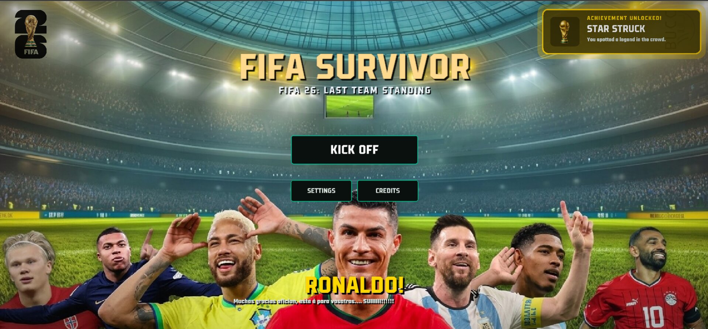
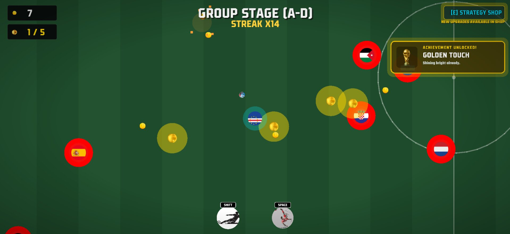

#  FIFA Survivor
### FIFA 26: Last Team Standing

**A Competitive Arcade Survival Experience — Built Solo for BUCC R&D, Club Fair Summer 2026**

> Survive an endless World Cup of rival nations in this fast-paced arcade shooter. Dodge, dash, and outlast waves of scaling defenders, collect coins to unlock upgrades in the Strategy Room, and chase the #1 spot on a live global leaderboard synced in real time via Firebase.

  

  

---

##  Overview

Developed as a solo initiative representing the **Research & Development Department** of BUCC (BRAC University Computer Club) for the Club Fair of Summer 2026, **FIFA Survivor** is a high-octane 2D web game built to test player reflexes and real-time strategic decision-making.

The core directive was to maximize **audience engagement**. Instead of a static single-player experience, the game features a custom-engineered live, cloud-synced global leaderboard. This transforms the game from a solo activity into a dynamic, crowd-driven competition where attendees can actively fight to dethrone the current high score on the show floor.

##  Core Features

* ** Live Global Leaderboard** — Integrated natively with Google Firestore, fetching and updating the Top 5 players in real time to drive continuous crowd engagement. Server-side security rules validate every write, so scores can't be forged or injected from outside the game.
* ** Dynamic Strategy Room (Shop)** — Players balance risk and reward by spending hard-earned coins on mid-game stat upgrades (Speed, Fire Rate, Magnet Radius) or saving up for Endgame Tactics (Shotgun, Energy Shield, Piercing Ball). One press, one purchase — full control over how a run's economy is spent.
* ** Scaling Difficulty Engine** — Enemy spawn rates, speeds, and boss-tier defenders escalate dynamically the longer a player survives.
* ** Match Milestones** — A full achievement system tracks standout moments across a run, from first kills to rare, hard-earned feats.
* ** Built for Any Screen** — Native on-screen touch controls (joystick + action buttons), safe-area-aware layout, and an installable PWA shell mean the game plays just as well on a phone as it does at a booth monitor.
* ** Premium UI/UX** — Custom loading sequence, smooth state transitions, hype callouts for the players on the menu screen, and responsive scaling to fit any display perfectly.

##  Technology Stack

| Layer | Technology |
|---|---|
| Game Engine | [Kaboom.js](https://kaboomjs.com) — 60FPS 2D canvas rendering |
| Backend / Database | Firebase Firestore — real-time NoSQL, server-validated writes |
| Languages | JavaScript (ES6+), HTML5, CSS3 |
| Deployment | Vercel — static site, zero build step |
| Distribution | Installable PWA (home-screen icon, offline-safe boot) |

##  How to Play

| Action | Input |
|---|---|
| Move | `W A S D` or Arrow Keys / on-screen joystick |
| Shoot | Automatic target acquisition |
| Dash | `Shift` / on-screen DASH button |
| Special Skill | `Space` — Kinetic Bicycle-Kick AoE Cleave |
| Strategy Room | `E` — pause the match and open the upgrade shop |

**The objective:** survive the endless horde of national-team defenders, collect golden balls to build your economy, spend them wisely in the Strategy Room, and dethrone the #1 player on the Global Leaderboard.

##  Local Installation (For Developers)

1. Clone this repository: `git clone https://github.com/yourusername/fifa-survivor.git`
2. Open the directory in your preferred IDE (e.g., VS Code).
3. Serve it with any static/live server (needed to avoid CORS canvas errors — `npx serve .` works fine).
4. Firebase initializes automatically from `src/config.js`. To point the game at your own Firebase project instead, swap the `firebaseConfig` values there and publish `firestore.rules` to your project's Firestore console.

##  Deploying to Vercel

This is a static site — no build step, no environment variables required. Vercel auto-detects it on import. After your first deploy:

1. Open `index.html` and replace the domain in the `og:image` / `twitter:image` meta tags with your real Vercel domain, so link previews (Discord, WhatsApp, X, etc.) resolve the screenshot correctly.
2. Paste `firestore.rules` into **Firebase Console → Firestore Database → Rules → Publish** — this is a separate, manual step; deploying to Vercel does not touch Firebase.
3. (Optional) Turn on **Web Analytics** for the project in the Vercel dashboard — the tracking script is already wired up in `index.html`.

##  License

Released under the [MIT License](LICENSE) — free to use, modify, and build on, with attribution.

---

<i>Built with ⚽, ☕, and way too many playtesting sessions.</i>

